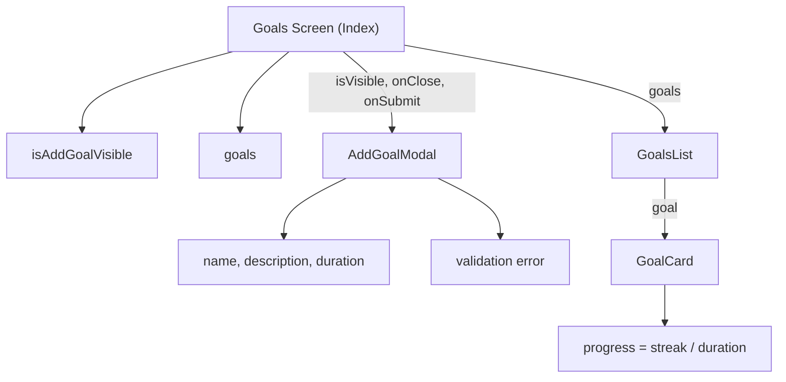
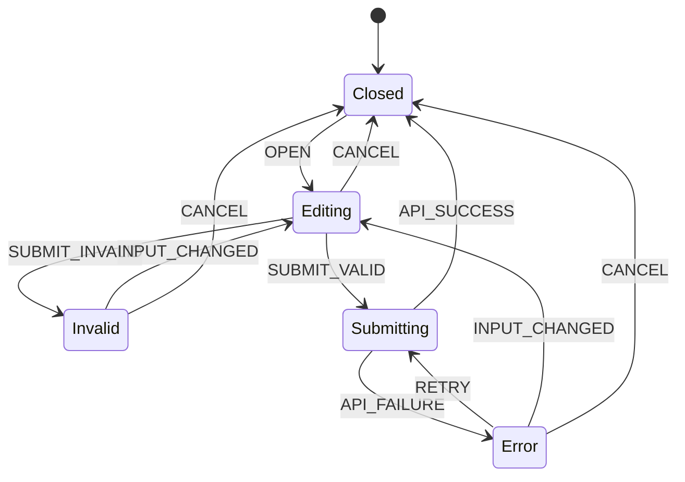
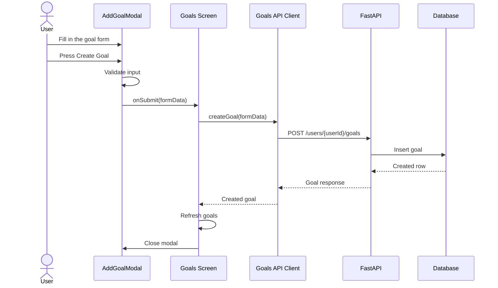

# NailedIt

NailedIt is a cross-platform habit and goal-tracking application for creating
goals, recording daily check-ins, and building consistent habits.

This repository contains the Expo and React Native client. A FastAPI backend is
being developed alongside it to provide persistent goal storage, user
management, and daily check-ins.

## Project status

NailedIt is a work in progress.

Currently implemented:

- Three-tab navigation for Goals, Nailed, and Profile
- Reusable goal list, goal card, and button components
- A segmented progress ring based on `streak / duration`
- A validated Add Goal form presented in a keyboard-aware modal
- Local goal creation with immediate, state-driven list updates
- TypeScript types for goals and form data
- Android, iOS, and Web targets through Expo

Currently in progress:

- Connecting the client to the FastAPI REST API
- Replacing temporary in-memory goals with persistent database data
- Loading, error, empty, and retry states for API requests
- Authentication and current-user state
- PostgreSQL migration and deployment

> New goals currently live only in client memory. Reloading the application
> resets the list to its initial data.

## Technology

### Client

- TypeScript
- React
- React Native
- Expo
- Expo Router

### Backend

- Python
- FastAPI
- SQLAlchemy
- Pydantic
- SQLite during local development
- PostgreSQL migration planned

The backend currently implements seven functional business endpoints across
user management, goal CRUD, and daily check-ins, backed by a three-table
relational model for users, goals, and check-ins.

## Architecture

### Component and state ownership

Each unique piece of state has one owner. The screen owns data shared by
multiple components, while the modal keeps its form-specific state local.
Values that can be calculated, such as goal progress, are derived during
rendering instead of being stored as additional state.



### Add Goal state model

The current implementation uses React state and callbacks. This state diagram
documents the intended behavior as API integration is added.



### Create Goal request flow

The client-to-database flow below represents the target API-integrated
implementation. At present, the client stops after the local state update.



## Current client data flow

The application currently uses a temporary in-memory workflow:

```text
AddGoalModal
    -> validates AddGoalFormData
    -> calls the parent onSubmit callback
    -> Goals Screen creates a local Goal
    -> setGoals creates a new goals array
    -> GoalsList receives the new array
    -> FlatList renders the new GoalCard
```

The next iteration will replace local goal creation with:

```text
POST goal
    -> backend writes to the database
    -> backend returns the persisted Goal
    -> client refreshes or updates its server-state cache
```

## Project structure

```text
src/
├── app/
│   ├── _layout.tsx
│   └── (tabs)/
│       ├── _layout.tsx
│       ├── index.tsx
│       ├── nailed.tsx
│       └── profile.tsx
├── components/
│   ├── AddGoalModal.tsx
│   ├── Button.tsx
│   ├── GoalCard.tsx
│   └── GoalsList.tsx
└── types/
    └── goal.ts
```

As API integration is introduced, request logic will be separated from UI
components:

```text
src/
├── api/
│   └── goals.ts
├── hooks/
│   └── useGoals.ts
└── ...
```

## Getting started

### Requirements

- Node.js supported by the installed Expo SDK
- npm
- Expo Go, an Android emulator, an iOS simulator, or a web browser

### Install dependencies

```bash
npm install
```

### Start the development server

```bash
npx expo start
```

The Expo CLI provides options for opening the application on Android, iOS, or
Web.

You can also start a specific target:

```bash
npm run android
npm run ios
npm run web
```

### Type-check

```bash
npx tsc --noEmit
```

## Domain types

The current client-side domain model is:

```ts
type Goal = {
  id: number;
  name: string;
  description: string;
  duration: number;
  streak: number;
};

type AddGoalFormData = {
  name: string;
  description: string;
  duration: number;
};
```

The API response model will add persistence fields such as `user_id`,
`created_at`, `last_checked_in_at`, and `longest_streak`.

## Roadmap

- [x] File-based tab navigation
- [x] Reusable GoalCard and GoalsList components
- [x] Dynamic streak progress visualization
- [x] Validated Add Goal modal
- [x] Local state-driven goal creation
- [ ] Load goals from the REST API
- [ ] Persist new goals through the REST API
- [ ] Add daily check-in actions
- [ ] Add loading, empty, error, and retry states
- [ ] Add authentication and authorization
- [ ] Add edit and delete goal workflows
- [ ] Add automated client and API tests
- [ ] Migrate the database to PostgreSQL
- [ ] Add CI and production deployment

## License

This project is licensed under the terms in [LICENSE](LICENSE).
